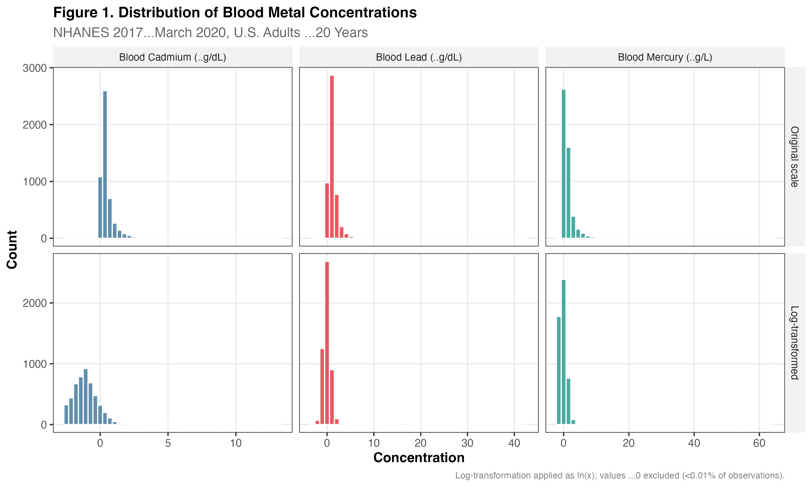
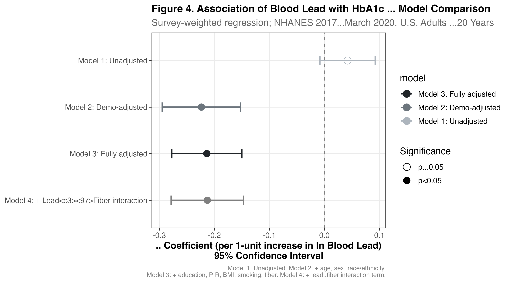
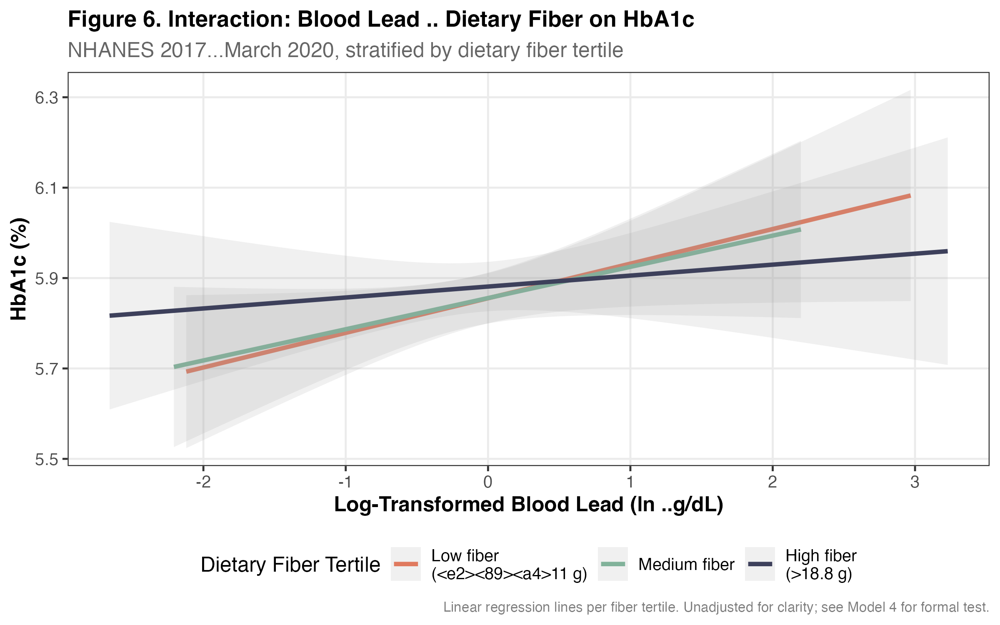

# Environmental Metal Exposure, Nutrition, and Cardiometabolic Biomarkers
### A Reproducible Cross-Sectional Analysis of NHANES 2017–2018

[](https://github.com/bobaoxu2001/nhanes-metal-nutrition-biomarkers/actions/workflows/reproducibility-check.yml)
[](https://github.com/bobaoxu2001/nhanes-metal-nutrition-biomarkers/actions/workflows/full-pipeline-render.yml)
[](https://cran.r-project.org/)
[](https://wwwn.cdc.gov/nchs/nhanes/)
[](LICENSE)
[](https://quarto.org/)

---

## Quick Navigation

| If you want to… | Open this |
|---|---|
| Read the full research write-up | [`report/nhanes_metal_nutrition_biomarkers.html`](report/nhanes_metal_nutrition_biomarkers.html) (also as [PDF](report/nhanes_metal_nutrition_biomarkers.pdf)) |
| Read a one-page summary | [`docs/executive_summary.md`](docs/executive_summary.md) |
| Understand methods and statistical decisions | [`docs/methods_notes.md`](docs/methods_notes.md) |
| Look up any analysis variable | [`docs/variable_dictionary.md`](docs/variable_dictionary.md) |
| Reproduce everything in one command | [`run_all.R`](run_all.R) — `Rscript run_all.R` |
| Inspect the regression code | [`R/05_regression_models.R`](R/05_regression_models.R) |

---

## Overview

This project examines whether **blood metal concentrations** (lead, cadmium, mercury) are associated with **glycated hemoglobin (HbA1c)** among U.S. adults, and whether **dietary fiber** modifies these associations. The analysis uses survey-weighted regression appropriate for the complex NHANES sampling design and is delivered as a fully reproducible Quarto report.

**Final analytic sample:** 5,014 U.S. adults (≥20 years) from NHANES 2017–2018, with valid blood metal and HbA1c measurements.

**Headline result:** After full adjustment for demographic, socioeconomic, behavioral, and dietary factors, log blood lead was inversely associated with HbA1c (β = −0.21, 95% CI: −0.28, −0.15; p < 0.001), while the unadjusted association was small and non-significant. Because this is a cross-sectional observational analysis, this should be interpreted as an adjusted statistical association rather than evidence of a protective effect; the direction reversal between the unadjusted and adjusted models may reflect residual confounding, selection, the timing window captured by blood-lead measurement, or model specification, and warrants further longitudinal investigation.

---

## Visual Summary

Each plot is paired with a plain-language interpretation so reviewers can quickly see not only the output, but also the epidemiologic reasoning behind it.

### 1. Exposure distributions: why log-transform metals?



**What this shows:** Blood lead, cadmium, and mercury are right-skewed biomarkers, with most adults at low levels and a smaller number of higher-exposure observations.

**Why it matters:** This distribution supports the use of natural-log transformation before regression, a common environmental epidemiology practice for skewed exposure biomarkers.

**Key takeaway:** The analysis begins with a defensible exposure transformation rather than treating raw metal concentrations as normally distributed.

### 2. Sequential model adjustment: lead and HbA1c



**What this shows:** The estimated association between log blood lead and HbA1c changes across unadjusted, demographic-adjusted, and fully adjusted survey-weighted models.

**Why it matters:** The direction reversal after adjustment highlights how demographic and socioeconomic confounding can shape environmental epidemiology findings.

**Key takeaway:** The result is not interpreted as a protective effect of lead; it is treated as evidence that the adjusted association is sensitive to confounding structure and model specification.

### 3. Effect modification: dietary fiber



**What this shows:** The lead-HbA1c relationship is visualized across dietary fiber tertiles.

**Why it matters:** This tests whether nutrition may modify the association between environmental metal exposure and glycemic biomarkers.

**Key takeaway:** The plot is an exploratory visualization; formal inference comes from the survey-weighted lead × fiber interaction model.

📄 **Full report:** [`report/nhanes_metal_nutrition_biomarkers.html`](report/nhanes_metal_nutrition_biomarkers.html) (HTML, self-contained) · [PDF](report/nhanes_metal_nutrition_biomarkers.pdf)

---

## Research Question

> Are blood concentrations of lead, cadmium, and mercury associated with HbA1c among U.S. adults aged ≥20, and does dietary fiber intake modify these associations?

| | |
|--|--|
| **Primary exposure** | Blood lead (µg/dL), log-transformed |
| **Primary outcome** | HbA1c (%); secondary: elevated HbA1c ≥5.7% |
| **Effect modifier** | Dietary fiber (g/day) |
| **Design** | Cross-sectional; survey-weighted |
| **Cycle** | NHANES 2017–2018 |

---

## Data Source

**National Health and Nutrition Examination Survey (NHANES)** — CDC / National Center for Health Statistics. Public domain (U.S. government data).

- Public access: https://wwwn.cdc.gov/nchs/nhanes/
- **Download method:** Direct XPT download from the CDC public data repository via `curl` + `haven::read_xpt()`, with retry and fallback to `download.file()`. See [`docs/methods_notes.md`](docs/methods_notes.md) and `R/01_download_data.R`.

**NHANES files used (cycle 2017–2018, suffix `_J`):**

| Domain | File | Variables |
|--------|------|-----------|
| Demographics | `DEMO_J` | Age, sex, race/ethnicity, education, PIR, survey design |
| Blood metals | `PBCD_J` | Blood lead (`LBXBPB`), cadmium (`LBXBCD`), total mercury (`LBXTHG`) |
| HbA1c | `GHB_J` | Glycated hemoglobin (`LBXGH`) |
| C-reactive protein | `HSCRP_J` | High-sensitivity CRP (`LBXHSCRP`) |
| Cholesterol | `TCHOL_J`, `HDL_J` | Total and HDL cholesterol |
| Blood pressure | `BPX_J`, `BPQ_J` | BP readings + medication status |
| Body measures | `BMX_J` | BMI |
| 24-hr dietary recall (Day 1) | `DR1TOT_J` | Fiber, vitamin C, energy, calcium, iron |
| Smoking | `SMQ_J` | Smoking status |

---

## Methods Summary

| Step | Approach |
|------|---------|
| Data download | Direct CDC XPT files via `curl` (180 s timeout, 3 retries); cached locally as `.rds` |
| Merging | Left-join on `SEQN` across 11 NHANES files |
| Exclusions | Age <20; missing MEC weight; missing all metals; missing HbA1c |
| Exposure transformation | Natural log (right-skewed metals); quartile categorization for stratification |
| Outcome | HbA1c (continuous); elevated HbA1c ≥5.7% (binary; ADA prediabetes threshold) |
| Survey design | `svydesign(ids = ~SDMVPSU, strata = ~SDMVSTRA, weights = ~WTMEC2YR, nest = TRUE)` |
| Linear regression | `svyglm(gaussian())`: 4 sequential models (unadjusted → demographic → fully adjusted → + lead×fiber interaction) |
| Logistic regression | `svyglm(quasibinomial())`: 3 models for elevated HbA1c |
| Sensitivity | Cadmium and mercury substituted for lead in fully adjusted model |
| Visualization | `ggplot2` + `patchwork`; 7 publication-quality figures |
| Tables | `gtsummary` + `flextable` → DOCX |
| Report | Quarto (`.qmd`) → self-contained HTML and PDF |

A normal approximation (z-test) is used for confidence intervals in fully adjusted models because the parameter count exceeds the design degrees of freedom (15) — a standard NCHS-recommended approach for large NHANES samples. See [`docs/methods_notes.md`](docs/methods_notes.md).

---

## Project Structure

```
nhanes-metal-nutrition-biomarkers/
├── README.md
├── LICENSE
├── nhanes-metal-nutrition-biomarkers.Rproj
├── package_setup.R                         ← Install R package dependencies
├── run_all.R                               ← One-command end-to-end pipeline runner
│
├── R/
│   ├── 00_setup.R                  ← Libraries, paths, helper functions
│   ├── 01_download_data.R          ← Direct CDC XPT download (curl + retry)
│   ├── 02_clean_merge_data.R       ← Merge, harmonize, apply exclusions
│   ├── 03_define_variables.R       ← Transformations, binary outcomes, labels
│   ├── 04_descriptive_analysis.R   ← Table 1, missingness, correlations
│   ├── 05_regression_models.R      ← Linear + logistic survey-weighted models
│   ├── 06_visualizations.R         ← 7 ggplot2 figures
│   └── 07_export_tables_figures.R  ← Export tables to DOCX
│
├── data/
│   ├── raw/          ← Raw NHANES .rds (gitignored; downloaded by 01_)
│   ├── processed/    ← analysis_dataset_v2.rds (gitignored; reproducible)
│   └── codebook/     ← Variable inspection & missingness reports
│
├── outputs/
│   ├── tables/       ← Table 1–4 (.docx) + regression CSVs
│   └── figures/      ← fig01–fig07 (.png, 300 dpi)
│
├── report/
│   ├── nhanes_metal_nutrition_biomarkers.qmd  ← Source
│   ├── nhanes_metal_nutrition_biomarkers.html ← Rendered (self-contained)
│   └── nhanes_metal_nutrition_biomarkers.pdf  ← Rendered
│
└── docs/
    ├── analytic_plan.md        ← Pre-analysis plan with hypotheses
    ├── variable_dictionary.md  ← All variables with NHANES names and coding
    └── methods_notes.md        ← Methodological decisions and rationale
```

---

## Reproducing the Analysis

### Prerequisites

- **R** ≥ 4.1 (developed and tested on 4.1.2)
- **Quarto** ≥ 1.3
- Active internet connection (CDC NHANES download)

> **Note on CI.**
> - **Structure & Setup Check** (`.github/workflows/reproducibility-check.yml`) runs automatically on push/pull_request. It verifies that R installs the needed packages, that `R/00_setup.R` sources cleanly, that all numbered scripts parse, and that the expected project structure exists.
> - **Full Pipeline Render** (`.github/workflows/full-pipeline-render.yml`) is available as a manual `workflow_dispatch` action because CDC NHANES downloads can be slow or rate-limited on shared runners.
> - **Local full reproduction** is available with `Rscript run_all.R`.

### One-command reproduction (recommended)

```bash
git clone https://github.com/bobaoxu2001/nhanes-metal-nutrition-biomarkers.git
cd nhanes-metal-nutrition-biomarkers
Rscript package_setup.R    # install required R packages
Rscript run_all.R          # runs all 8 scripts in order, then renders the Quarto report
```

`run_all.R` sources scripts `R/00_setup.R` → `R/07_export_tables_figures.R` in sequence, prints a timing banner for each step, and stops with an informative error if any step fails. It then renders the Quarto report to HTML and PDF (if `quarto` is on PATH).

### Step-by-step (for development)

```bash
Rscript R/00_setup.R
Rscript R/01_download_data.R       # ~5–15 min on first run
Rscript R/02_clean_merge_data.R
Rscript R/03_define_variables.R
Rscript R/04_descriptive_analysis.R
Rscript R/05_regression_models.R
Rscript R/06_visualizations.R
Rscript R/07_export_tables_figures.R
quarto render report/nhanes_metal_nutrition_biomarkers.qmd
```

If the CDC download fails, you can manually download XPT files from the [NHANES 2017–2018 page](https://wwwn.cdc.gov/nchs/nhanes/continuousnhanes/default.aspx?BeginYear=2017) and place them in `data/raw/` as `.rds`:
```r
saveRDS(haven::read_xpt("PBCD_J.XPT"), "data/raw/PBCD_J.rds")
```

---

## Main Outputs

| Output | Location |
|--------|----------|
| Table 1 — Overall characteristics | `outputs/tables/table1_overall.docx` |
| Table 1b — By lead quartile | `outputs/tables/table1_by_lead_quartile.docx` |
| Table 2 — Linear regression (lead → HbA1c) | `outputs/tables/table2_linear_regression.docx` |
| Table 3 — Logistic regression (elevated HbA1c) | `outputs/tables/table3_logistic_regression.docx` |
| Table 4 — Multi-metal sensitivity | `outputs/tables/table4_sensitivity_metals.docx` |
| Figures 1–7 | `outputs/figures/fig01–fig07.png` |
| Full report | `report/nhanes_metal_nutrition_biomarkers.html` (and `.pdf`) |

---

## What This Demonstrates for Research Teams

This project demonstrates my ability to support epidemiology research teams by turning a research question into a reproducible R analysis pipeline, producing publication-style tables and figures, and documenting analytic decisions clearly enough for faculty, collaborators, and future analysts to audit or extend the work. Every modeling choice (single-cycle weights, log transforms, sequential adjustment, survey-weighted stratification, normal-approximation degrees of freedom) is recorded in `docs/methods_notes.md`; every variable is recorded in `docs/variable_dictionary.md`; and the entire pipeline reproduces with one command (`Rscript run_all.R`).

The work mirrors the rhythm of an academic team: pre-analysis plan → reproducible cleaning → Table 1 → sequential regression → sensitivity analyses → effect-modification analysis → publication-ready report — with honest, association-only interpretation rather than overclaiming.

---

## Quality-Control Checks

- ✅ **Verified NHANES variable names against the actual downloaded XPT files** (e.g., `LBXBPB`, `LBXGH`, `WTMEC2YR`, `SDMVPSU`, `SDMVSTRA`, `LBXHSCRP`).
- ✅ **Used real CDC/NHANES public data**, downloaded directly from the public CDC repository — not simulated, scraped, or pre-bundled data.
- ✅ **Used `SEQN` for deterministic multi-file merging** across all 11 NHANES domain files; merge integrity verified by exclusion log.
- ✅ **Used `SDMVPSU`, `SDMVSTRA`, and `WTMEC2YR`** for survey-weighted analysis via `survey::svydesign(nest = TRUE)`.
- ✅ **Used single-cycle `WTMEC2YR` directly** (no halving/pooling adjustment), per NCHS analytic guidance for a single 2-year cycle.
- ✅ **Excluded raw NHANES files from Git** (gitignored `data/raw/` and `data/processed/*.{rds,csv}`); raw data are reproducibly re-downloadable via `R/01_download_data.R`.
- ✅ **Quarto report rendered from code-generated tables and figures** — no hand-edited numbers; every estimate in the report comes from a CSV produced by `R/05_regression_models.R`.
- ✅ **Survey-weighted stratified analysis** within each fiber tertile (not naive `lm()`).
- ✅ **Interpreted results as adjusted statistical associations**, not causal effects; the unadjusted-vs-adjusted direction reversal is explicitly addressed in both the report and the README.

---

## Skills Demonstrated

- Real public-health data acquisition (programmatic NHANES download)
- Complex survey design analysis (`survey` package, weights/strata/PSUs)
- Multi-file merging and harmonization (11 NHANES files, single SEQN key)
- Variable engineering: log transforms, quartiles, z-scores, binary thresholds
- Publication-quality Table 1 with `gtsummary`
- Survey-weighted linear and logistic regression with sequential adjustment
- Effect-modification analysis via continuous interaction
- `ggplot2` + `patchwork` for 7 publication-quality figures
- Reproducible Quarto research report (HTML + PDF)
- Project documentation: pre-analysis plan, variable dictionary, methods notes
- Portable project structure with `here`

---

## Limitations

This analysis is **cross-sectional and association-based; it does not support causal inference**. Blood metals reflect recent exposure (lead, mercury) or cumulative kidney burden (cadmium); chronic-exposure effects relevant to long-term glycemia may be misclassified. Day-1 dietary recall is subject to measurement error. Complete-case analysis assumes missing-at-random. See the report's *Limitations* section and `docs/methods_notes.md` for full discussion.

---

## Future Extensions

1. **Metal mixture modeling** — Weighted Quantile Sum (WQS) or Bayesian Kernel Machine Regression
2. **Mediation analysis** — does BMI mediate the lead–HbA1c relationship?
3. **Race/ethnicity stratification** — disparities in metal bioaccumulation
4. **Additional outcomes** — high-sensitivity CRP, eGFR, blood pressure
5. **Multiple imputation** for missing dietary data
6. **Healthy Eating Index (HEI-2015)** as a richer nutrition exposure

---

## Author

**Allen Xu** · ax2183@nyu.edu  
New York University

## License

MIT — see [LICENSE](LICENSE). NHANES data are public domain.

## Citation

> Xu, Allen. (2025). *Environmental Metal Exposure, Nutrition, and Cardiometabolic Biomarkers: A Reproducible Cross-Sectional Analysis of NHANES 2017–2018.* GitHub. https://github.com/bobaoxu2001/nhanes-metal-nutrition-biomarkers

**Data citation:**
> National Center for Health Statistics. National Health and Nutrition Examination Survey Data, 2017–2018. Hyattsville, MD: U.S. Department of Health and Human Services, Centers for Disease Control and Prevention. https://wwwn.cdc.gov/nchs/nhanes/.
